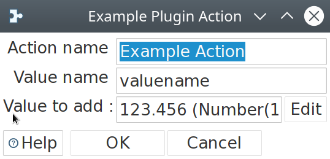

= Sample Action

== Description

This is a sample action that is intended to serve as a blueprint for plugin development.

== Options

* *Action name*: The name for this action.
* *Value name*: the field name for this action's value.
* *Value to add*: the (hard coded) value + data type to add for this action.

